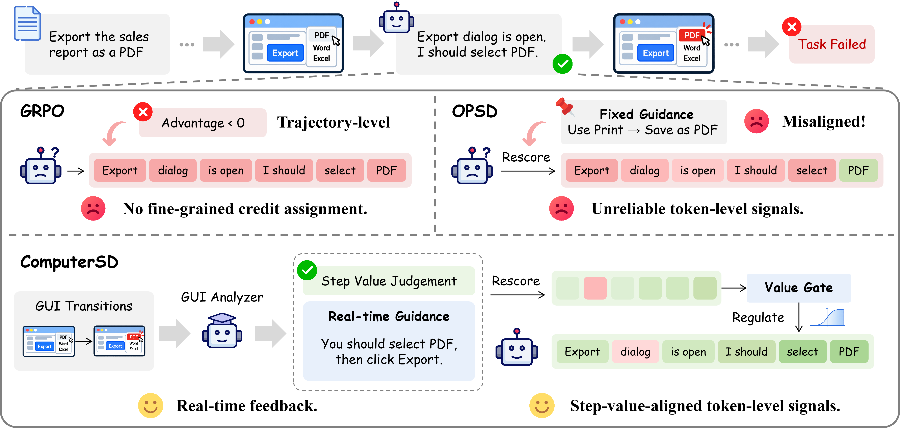
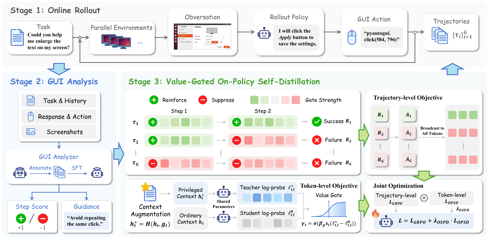
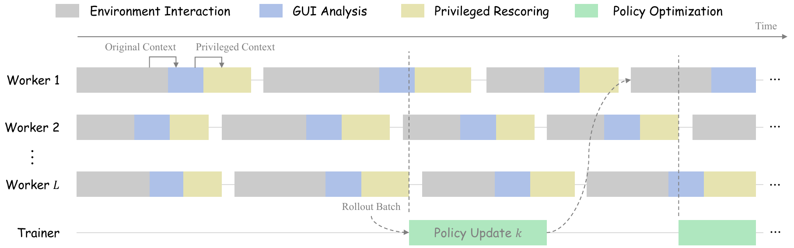

<h1 align="center">
  ComputerSD
</h1>

<div align="center">

<p><em>Online Self-Distillation from Real-Time Feedback for Computer-Use Agents</em></p>

[Yong Du](mailto:duyong123@zju.edu.cn)<sup>1</sup>, &nbsp; Tongbo Chen<sup>1</sup>, &nbsp; Zhengxi Lu<sup>1</sup>, &nbsp; Yizhou Liu<sup>1</sup>, &nbsp; Bofan Chen<sup>1</sup>, <br>
Tao Jiang<sup>2</sup>, &nbsp; Wenhao Xu<sup>2</sup>, &nbsp; [Yongliang Shen](mailto:syl@zju.edu.cn)<sup>1,†</sup>  

<sup>1</sup>Zhejiang University, &nbsp; <sup>2</sup>Ant Group

[](https://arxiv.org/abs/2609.40253) [](https://github.com/ZJU-REAL/ComputerSD)

</div>

---
<div align="center">
  
</div>

ComputerSD helps computer-use agents learn from ongoing interaction with executable GUI environments. After each action, a GUI analyzer turns the resulting state transition into real-time guidance and a step-level value score. The guidance supplies privileged context for online self-distillation, while the value score regulates its token-level learning signals. ComputerSD combines these signals with trajectory-level GRPO in a fully asynchronous training framework. On OSWorld-Verified, it improves success rates over outcome-only GRPO by 1.9 percentage points with Qwen3-VL-8B-Thinking and 4.1 points with EvoCUA-8B.

---

## Quick Start


```bash
git clone https://github.com/ZJU-REAL/ComputerSD.git
cd ComputerSD
conda create -n computersd python=3.12.3 pip -y
conda activate computersd
bash setup.sh

export HF_CKPT=path/to/qwen3-vl-8b-thinking
export ANALYZER_MODEL_PATH=path/to/gui-analyzer
export GUI_ENV_SERVER_URL=http://gui-env-host/osworld-node
bash online-rl/scripts/gui_qwen3vl_16gpu_async_grpo_opd.sh
```

Replace the placeholder model paths and server address with your own. `setup.sh` installs the CUDA 12.9 GPU stack and the pinned Python packages in `requirements.txt`; the launcher uses the bundled `online-rl/`, `slime/`, and `Megatron-LM/` sources.

## Method in Brief



**GUI analyzer supervised fine-tuning (Section 3.2).** We collect diverse successful and unsuccessful trajectories from a base policy interacting with OSWorld. An expert model annotates each step's GUI transition with guidance and a value score. A GUI analyzer initialized from the same base policy is then fine-tuned on these annotations and frozen for subsequent online policy training, where it provides real-time feedback after each action.

**Value-gated on-policy self-distillation (Section 3.3).** For each task, the policy samples a group of trajectories, whose terminal outcomes determine the group-relative GRPO signal. At each executed step, the analyzer supplies guidance and a value score. We rescore the sampled response under its ordinary context and under a privileged context augmented with that guidance. A value gate uses the score to regulate the resulting token-level probability shifts, reinforcing signals aligned with the step judgment and suppressing misaligned ones. The gated self-distillation objective is optimized jointly with GRPO; the deployed agent acts from ordinary context alone.

**Fully asynchronous training.** Environment interaction, GUI analysis, and privileged rescoring proceed across rollout workers while the trainer updates the policy from collected trajectory batches. Updated policy weights are published asynchronously to the workers for subsequent interactions.



## Results

OSWorld-Verified success rate (Pass@1). These results are averaged over three independent evaluation runs.

| Model | Type | Max Steps | Success Rate (%) |
| --- | --- | ---: | ---: |
| Qwen3-VL-8B-Thinking | General | 50 | 33.8 |
| ↳ w/ GRPO | General | 50 | 37.9 |
| ↳ **w/ ComputerSD** | General | 50 | **39.8** |
| EvoCUA-8B | Specialized | 50 | 41.3 |
| ↳ w/ GRPO | Specialized | 50 | 43.8 |
| ↳ **w/ ComputerSD** | Specialized | 50 | **47.9** |

## Acknowledgements

This work builds on [slime](https://github.com/THUDM/slime).

## Citation
